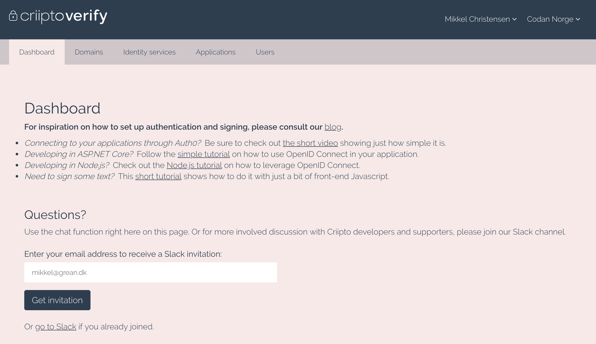
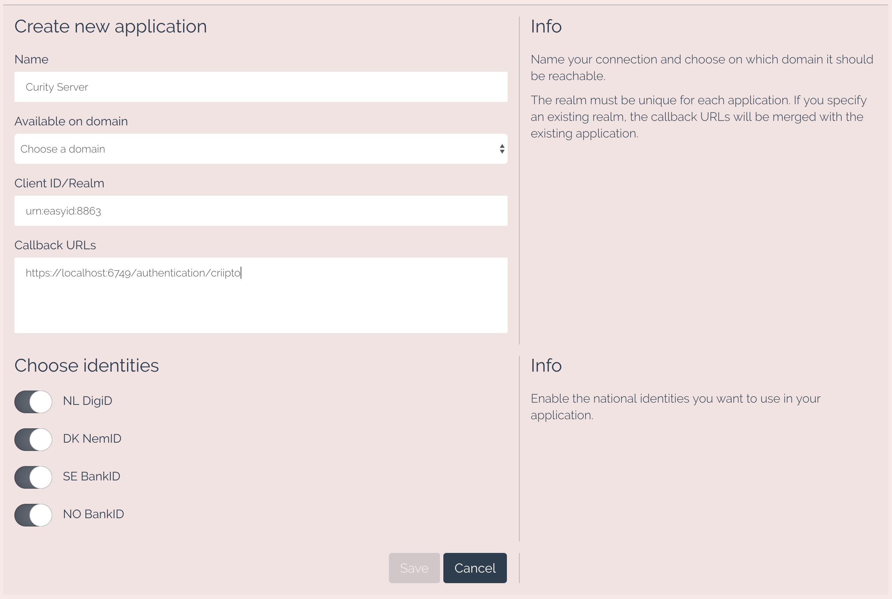
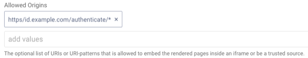

Criipto Authenticator Plug-in
=============================
   
.. image:: https://img.shields.io/badge/quality-test-yellow
       :target: https://curity.io/resources/code-examples/status/
       
.. image:: https://img.shields.io/badge/availability-binary-blue
       :target: https://curity.io/resources/code-examples/status/

This project provides an opens source Criipto Authenticator plug-in for the Curity Identity Server. This allows an administrator to add functionality to Curity which will then enable end users to login using their Criipto credentials. The app that integrates with Curity may also be configured to receive the Criipto access token, allowing it to manage resources in a Criipto.

System Requirements
~~~~~~~~~~~~~~~~~~~

* Curity Identity Server 2.4.0 and `its system requirements <https://developer.curity.io/docs/latest/system-admin-guide/system-requirements.html>`_.

Requirements for Building from Source
"""""""""""""""""""""""""""""""""""""

* Maven 3
* Java JDK v. 8

Compiling the Plug-in from Source
~~~~~~~~~~~~~~~~~~~~~~~~~~~~~~~~~

The source is very easy to compile. To do so from a shell, issue this command: ``mvn package``.

Installation
~~~~~~~~~~~~

To install this plug-in, either download a binary version available from the `releases section of this project's GitHub repository <https://github.com/curityio/criipto-authenticator/releases>`_ or compile it from source (as described above). If you compiled the plug-in from source, the package will be placed in the ``target`` subdirectory. The resulting JAR file or the one downloaded from GitHub needs to placed in the directory ``${IDSVR_HOME}/usr/share/plugins/criipto``. (The name of the last directory, ``criipto``, which is the plug-in group, is arbitrary and can be anything.) After doing so, the plug-in will become available as soon as the node is restarted.

.. note::

    The JAR file needs to be deployed to each run-time node and the admin node. For simple test deployments where the admin node is a run-time node, the JAR file only needs to be copied to one location.

For a more detailed explanation of installing plug-ins, refer to the `Curity developer guide <https://developer.curity.io/docs/latest/developer-guide/plugins/index.html#plugin-installation>`_.

Creating an account in Criipto Verify
~~~~~~~~~~~~~~~~~~~~~~~~~~~~~~~~~~~~~

Point your browser to the `Criipto Verify product page <https://www.criipto.com/products/criipto-verify/>`_.
There, you can find links to both the signup page and pricing details for production usage.

.. note:: 
    Spoiler alert: Creating an account is free, no credit card required.
    All features are available in the free version - the single restriction is that you can only log in with test identities.

Follow the guide to create a tenant in Criipto Verify, and you will end up on the dashboard:

You can find links to blogs and examples there, as well as sign up to Criipto's Slack channel where tech-support is available.
There is also a chat-feature on the dashboard where you can contact Criipto.

Creating a connection to Curity from Criipto Verify
"""""""""""""""""""""""""""""""""""""""""""""""""""

Navigate to the Applications tab - this is the place where you define the integration with your Curity server installation.

Click the 'manually' button and give your application a ``Name`` - this is just for display purposes, use whichever value you see fit:

\- here, we used ``Curity Server`` for the name, just to make it easy to identify the actual client later on.

Select the domain created for you during signup in the ``Available on domain`` dropdown.

The ``Client ID/Realm`` value is pre-filled with a unique value - you can change it to something more recognizable if you want.

.. note:: This is the value you must register in your Criipto Authenticators ``Client ID`` textfield in Curity (see below).

For the ``Callback URLs`` (multi-line) input, you must add the ``authentication`` endpoint in your Curity server where Verify should send the user back to after a successful authentication.
You can have several values here - and there is no restriction on which DNS domains you can use. But all values used at runtime must be registered here.
The value in here is just an example, you should consult your Curity Endpoints configuration for the actual value to use.

You can choose to disable any of the identity schemes that you will not be needing. You can also just leave them all enabled for the purpose of getting the integration set up.
You can always come back later and change which ones are enabled.

Now, click the ``Save`` button to store the basic configuration of your Curity connection.

The next task is to set up some additional details for the OAuth2 procotol communication between Curity and Criipto Verify.

1. Click on the application you just created:
    .. figure:: ./docs/images/criipto-verify-curity-application.png
        :align: center
2. Scroll down to the ``OpenID Connect`` section
    .. figure:: ./docs/images/criipto-verify-curity-openid-connect.png
        :align: center
3. Click the ``Enable OAuth2 Code Flow`` slider - a dialog pops up with a message about client secret creation. Click ``OK``.
4. A new dialog shows up, with a freshly generated client secret, and a description about how it must be handled. 
    .. note:: This is the value that you must set in the ``Client Secret`` textfield in your Criipto Authenticator configuration page in Curity (see below).
5. Click ``OK``.
6. Select ``fromTokenEndpoint`` in the ``User info response strategy`` dropdown.
7. Select ``compact`` in the ``JWT format`` dropdown.
8. Scroll down to the ``Advanced aptions`` section, and enter your Curity servers runtime host (and port, if non-standard) in the ``Frame origin`` textfield. You can find these values on the System -> Deployments page in Curity. Leave out the protocol from the value, Criipto Verify adds that automatically. 
    .. figure:: ./docs/images/criipto-verify-curity-advanced-options.png
        :align: center
9. Click ``Save``.

And - that's it for the Criipto Verify part!

Now, you can use the ``Client ID`` and ``Client Secret`` values to set up your Criipto Authenticator in Curity:

Creating a Criipto Authenticator in Curity
~~~~~~~~~~~~~~~~~~~~~~~~~~~~~~~~~~~~~~~~~~

Configuration using the Admin GUI
"""""""""""""""""""""""""""""""""

To configure a new Criipto authenticator using the Curity admin UI, do the following after logging in:

1. Go to the ``Authenticators`` page of the authentication profile wherein the authenticator instance should be created.
2. Click the ``New Authenticator`` button.
3. Enter a name (e.g., ``criipto1``). This name needs to match the URI component in the callback URI set in the Criipto app.
4. For the type, pick the ``Criipto`` option.
5. On the next page, you can define all of the standard authenticator configuration options like any previous authenticator that should run, the resulting ACR, transformers that should executed, etc. At the bottom of the configuration page, the Criipto-specific options can be found.

    .. figure:: docs/images/criipto-authenticator-type-in-curity.png
        :align: center
        :width: 600px

    .. note::

        The Criipto-specific configuration is generated dynamically based on the `configuration model defined in the Java interface <https://github.com/curityio/criipto-authenticator/blob/master/src/main/java/io/curity/identityserver/plugin/criipto/config/CriiptoAuthenticatorPluginConfig.java>`_.

6. Certain required and optional configuration settings may be provided. One of these optional settings is the ``HTTP Client`` setting. This is the HTTP client that will be used to communicate with the Criipto OAuth server's token and user info endpoints. You may choose to configure this if Curity will communicate with Criipto using a forwarding proxy. To define this, do the following:

    A. click the ``Facilities`` button at the top-right of the screen.
    B. Next to ``HTTP``, click ``New``.
    C. Enter some name (e.g., ``criiptoClient``).
    D. Click ``Apply``.

7. Back in the Criipto authenticator instance that you started to define, select the new HTTP client from the dropdown if you configured one; otherwise, skip this setting.
8. In the ``Client ID`` textfield, enter the client ID from the Criipto app configuration.
9. Also enter the matching ``Client Secret``.
10. Specify the domain to be used in the ``Domain`` textfield. This will be the subdomain of ``criipto.id`` or similar.
11. Choose the country's who's E-ID type should be used. For instance, choose ``sweden`` to use Swedish BankID, ``denmark`` for NemID, and ``norway`` for Norwegian Bank ID.
12. If ``sweden`` or ``norway`` are chosen, then another dropdown will be displayed allowing for the configuration of authentication using the same device or a different device in the case of Sweden or hardware token or mobile phone in the case of Norway.

Once all of these changes are made, they will be staged, but not committed (i.e., not running). To make them active, click the ``Commit`` menu option in the ``Changes`` menu. Optionally enter a comment in the ``Deploy Changes`` dialogue and click ``OK``.

Once the configuration is committed and running, the authenticator can be used like any other.

Configuration using the CLI
"""""""""""""""""""""""""""

It is very common to create many instances of the Criipto authenticator. For example, you may configure one for Swedish BankID using the same device and another for different devices. These may be put into a group or combined with other authenticators to provide a suite of Scandinavian E-IDs. This can be tedious to configure in the UI, so you may want to use the CLI to configure instances of this authenticator instead. Doing so is very easy:

1. Start the ``idsh`` command (located in ``$IDSVR_HOME/bin``)
2. Enter configuration mode by typing ``configure`` and hitting Enter.
3. Next, define the new Criipto authenticator instance in some authentication profile. For example, if the authentication profile is called ``for``, then the following commands would create the authenticator:

    .. code-block::

        set profiles profile foo authentication-service settings authentication-service authenticators authenticator criipto1 description "Other Device"
        set profiles profile foo authentication-service settings authentication-service authenticators authenticator criipto1 criipto
        set profiles profile foo authentication-service settings authentication-service authenticators authenticator criipto1 criipto client-id urn:easyid:1
        set profiles profile foo authentication-service settings authentication-service authenticators authenticator criipto1 criipto client-secret QWxhZGRpbjpvcGVuIHNlc2FtZQ==
        set profiles profile foo authentication-service settings authentication-service authenticators authenticator criipto1 criipto sweden login-using other-device
        set profiles profile foo authentication-service settings authentication-service authenticators authenticator criipto1 criipto domain example.criipto.id

4. After you have defined the Criipto authenticator instance, type ``commit`` to make the configuration active.
5. Exit the shell by typing ``exit`` followed by Enter two times or just hit ``Ctrl-D`` a couple times.

For more information on the CLI, refer to this `introductory video <https://developer.curity.io/videos/video/cli-introduction>`_.

Allowing Framing of Criipto
~~~~~~~~~~~~~~~~~~~~~~~~~~~

The Criipto authenticator frames the Criipto Verify service, so that the look and feel can be styled using Curity's normal theming mechanisms. In order for this to be allowed by modern browsers, however, all OAuth clients and service provider apps that use this authenticator must be configured to allow framing. The value should be the endpoint of the authentication service's authenticate endpoint with an asterisks appended. For instance, if the authentication service has an authentication endpoint at ``https://id.example.com/authenticate/``, then the apps' allowed framing settings should be updated to include ``https://id.example.com/authenticate/*``, as shown in the following figure:

License
~~~~~~~

This plugin and its associated documentation is listed under the `Apache 2 license <LICENSE>`_.

More Information
~~~~~~~~~~~~~~~~

Please visit `curity.io <https://curity.io/>`_ for more information about the Curity Identity Server.

Copyright (C) 2018 Curity AB.
